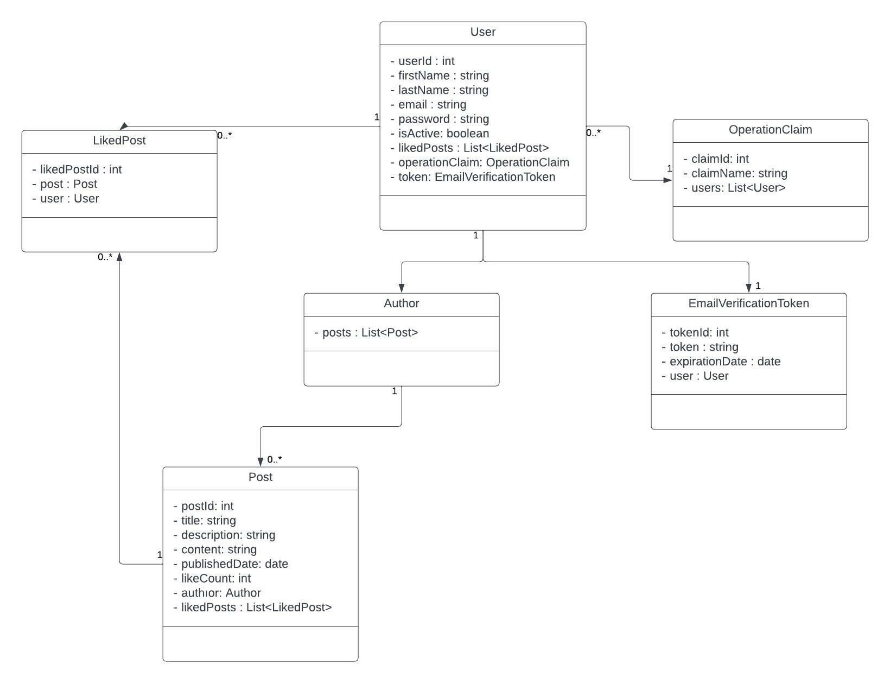

# Blog App Project
#### Backend codes of Blog App. This project is written by Java Spring Boot. Frontend Code of This Project is [Blog-App Frontend](https://github.com/VonHumbolt/BlogProject-Frontend).

## Live Code is Here. Try it now! -> [Blog-App](https://blog-app-react-project.herokuapp.com/)

## Brief

 Blog app project is a website project for people who want to share knowledge with 
other people. In blog app, users can read and like other people's blog posts, can
search and filter posts. 
They can also write and edit their own posts.
However, users must create an account to write and update posts.If users create an account, 
they can view their profile page and see the posts they like. Users can filter posts by 
their published date and number of likes. Also, posts can be paginated by users.

    Users are not required to register to view posts. Every post has a post detail page.
In post detail page, users can see the whole post and the person can like the post if they want.
In profile page, users can delete and edit their own posts.

## Technologies

 In this project's architecture, N-Layered architecture is used. There are 5 main layers in the
project. This project created with Spring Boot. The project was tried to be written in accordance with SOLID principles.
Dependency Injection, AOP techniques were applied. For database access, Spring Data Jpa
is used. In entity classes, Lombok and Spring Validation is used. Also, For authentication and authorization,
Spring Security and JWT are used.

    Database of the project is PostgreSql. For sending mail processing, Spring Java Mail sender is preferred.
Google Guava library preferred to easily perform list, set and map operations.

## UML Diagram of Project's Entities

 

## Layers
There are 5 main layers in the project. These are api, business, core, data access and 
entity. 

### 1- Api Layer
This layer contains the controller classes of the project's entities.
Controller classes makes the project accessible over the internet.

### 2- Business Layer
This package has 2 folders: Abstracts and Concretes. 
Abstracts folder contains interfaces for manager classes and dependency injection.
Concretes folder contains service classes. Business codes was written in here.

### 3- Data Access Layer
All necessary codes for accesing database in this package. This package contains 
interfaces which are extends JpaRepository interface.

### 4- Core Layer
This package is independent of the other packages of the project. In here,
there are commonly used classes and interfaces. Mail sender and security configurations
were done in here. Also, generating and verifying Jwt token operations are in these package.

### 5- Entity Layer
Each project entity is represented in a database table. These entities and dtos classes 
are here. 

## Contact 
Email: kaankaplan111@gmail.com

